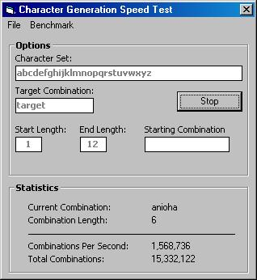



## Simple Bruteforce Class \(Very Stable\)

### Description

Simple and easy to use Bruteforce Class, Very stable and you can more the form. No program freezes. Also Includes a working example of how to use the class. The example is just a test form that calculates how fast your computer can calculate combinations. Please Compile and post a benchmark. Runs twice as fast compiled.
 
### More Info
 

             |
---                |---
**Submitted On**   |2005-06-01 20:54:44
**By**             |[�e7eN](https://github.com/Planet-Source-Code/PSCIndex/blob/master/ByAuthor/e7en.md)
**Level**          |Beginner
**User Rating**    |3.7 (11 globes from 3 users)
**Compatibility**  |VB 6\.0
**Category**       |[String Manipulation](https://github.com/Planet-Source-Code/PSCIndex/blob/master/ByCategory/string-manipulation__1-5.md)
**World**          |[Visual Basic](https://github.com/Planet-Source-Code/PSCIndex/blob/master/ByWorld/visual-basic.md)
**Archive File**   |[Simple\_Bru189618632005\.zip](https://github.com/Planet-Source-Code/e7en-simple-bruteforce-class-very-stable__1-60881/archive/master.zip)

